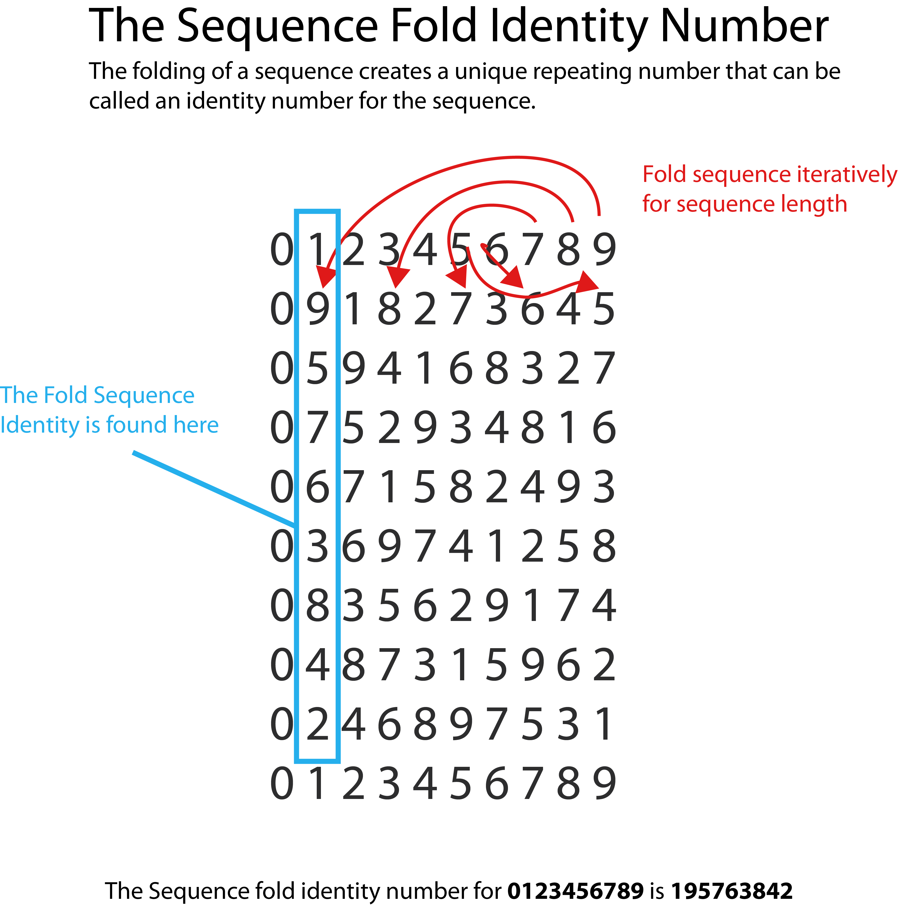
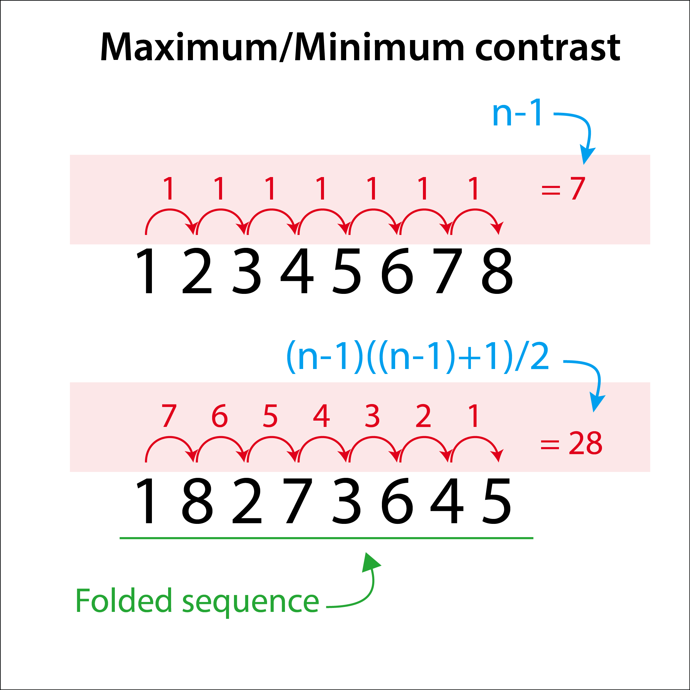

# identity-generator

An identity number generator. 
Created by Linus Jarbo and Hugo Angulo 2020

# About

In this program it is possible to generate a single identity number for an integer sequence. 
(but it is also possible to generate a recursive sequence of the single identity number)

The single identity number is found vertically as a repeating pattern in the repeated folding
of a sequence of integers. It repeats itself throughout the folding.

See the blue rectangle in the image below. Also note how the pattern repeats itself for every column but with another offset.

A single fold takes the integer, viewed as a positional container (updatable value) from the lowest contrasting value, to it's highest.
By folding the sequence repeatably it streches it from a minimum contrast to a maximum at every fold.

# Software
The generator is programmed in C# in Unity3d, version 2019.3.7f1

# Builds:
Builds can be found here (for the time being):

most recent build: 
Tis  8 Sep 2020 20:17:21 CEST

http://www.linusjarbo.com/IdentityNumber/index.html

# Bugs
- Copy to memory doesn't seem to work in webgl format? Does work in editor.

# Feature Requests
- save text to file
- add a strict recursive output so it can be used in mathematica(?)

# Updates, log
version 1.2

- use a font without kerning(spacing) suited for mathematics and readabillity
- Added recursive identity calculation at set number of iterations
- verbose toggle
